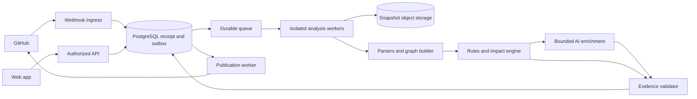

# 07 · System Architecture

Version: 0.1 · Status: proposed implementation design · Owner: Engineering

## Architecture decision

Start with a modular TypeScript application and independently deployed isolated workers. Use PostgreSQL for transactional entities and an adjacency-list relationship graph, object storage for short-lived source snapshots, and a durable managed queue. Exact hosting, authentication, queue, and object-storage vendors remain deployment decisions. A dedicated graph database is deferred until measured traversal needs justify it.

## Component responsibilities

- Web/API: sessions, memberships, installation binding, report access, feedback, and configuration.
- Ingress: raw-body signature verification, durable delivery receipt, deduplication, rapid acknowledgment.
- Scheduler: snapshot-aware analysis keys, quotas, supersession, leases, and cancellation.
- Ingestion: installation-scoped retrieval at immutable SHAs; file manifest, exclusions, size limits, secret filtering.
- Graph builder: parser facts, snapshot-specific nodes/edges, provenance, coverage inventory.
- Intelligence engine: rule evaluation, impact paths, ranked findings, completeness.
- AI adapter: bounded retrieval tools, strict candidate schemas, token/cost ceilings, provider failures.
- Validator/publisher: grounded findings, immutable report artifact, check reconciliation and retry.

## Transaction and consistency boundaries

A webhook receipt and outbox event commit together. Queue delivery is at least once. Workers acquire expiring leases and write each stage idempotently. An analysis key includes organization, repository, PR number, base/head SHAs, and configuration/pipeline version. Exactly-once user-visible effects come from uniqueness constraints and reconciliation, not queue promises.

Before publication, verify installation access and current PR head. Commit the validated report plus a publication intent atomically. Publishing is independently retryable. A GitHub failure does not rerun expensive analysis. Superseded analyses cannot update the latest report pointer or current-head check.

## Isolation and execution model

Workers never execute repository code or install project dependencies. Treat filenames, source, PR descriptions, and model responses as untrusted. Restrict worker egress to approved provider endpoints and storage. Use short-lived installation tokens, isolated temporary directories, bounded CPU/memory/time, and per-job cleanup. Private repository content never enters public analytics or shared caches.

## Failure behavior

Parser failure records uncovered scope. Provider failure may yield a partial deterministic report. Snapshot retrieval failure blocks claims about unavailable files. Database failure prevents acknowledgment unless the receipt was already durable. Revocation cancels work and prevents publication. A failed publication stays retryable without consuming another analysis entitlement.

## Scale and evolution

Cache extraction by tenant, repository, blob hash, parser version, and policy version. Rebuild changed-file facts and affected relationships while retaining snapshot isolation. Bound graph traversal and AI context. Scale workers by queue age and workload class before splitting services. Introduce multi-region or cross-repository graphs only after explicit privacy and consistency design.

See [data model](11-data-model-and-database-schema.md), [deployment](17-devops-and-deployment.md), and [runbook](23-operational-runbook.md).
